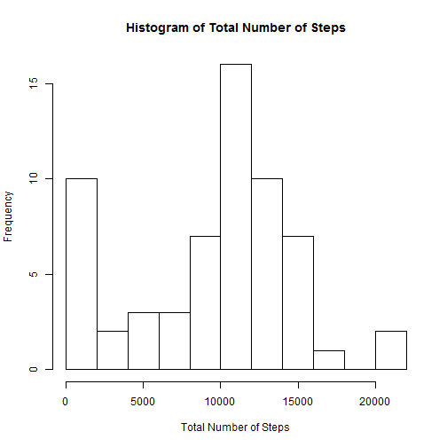
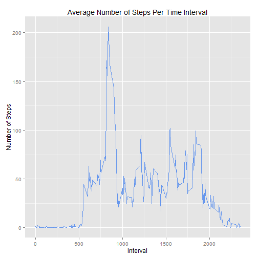
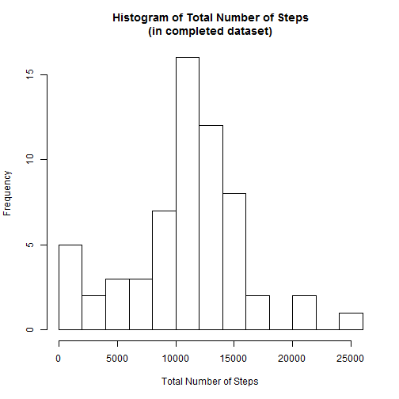
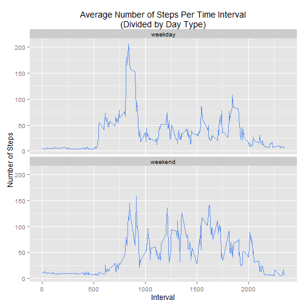

## Loading and preprocessing the data
To load and preprocess the data:

```r
data <- read.csv("activity.csv")
data$date <- as.Date(data$date)
```


## What is the mean total number of steps taken per day?
First, let's compute the total number of steps taken each day, and show that in a histogram. We will ignore the missing values in the dataset for now.

```r
library (dplyr)
totalSteps <- data %>% 
              group_by(date) %>% 
              summarise(steps = sum(steps, na.rm=T))
hist(totalSteps$steps, breaks=10, 
     main="Histogram of Total Number of Steps",
     xlab="Total Number of Steps")
```

 
Now, let's calculate the mean and median total number of steps.

```r
mean <- mean(totalSteps$steps)
median <- median(totalSteps$steps)
```
So, the mean number of steps is **9354.23** and the median is **10395**.

## What is the average daily activity pattern?
To display the average daily activity pattern, let's make a time series plot of the average number of steps taken per each 5-minute interval, averaged across all days.

```r
avgSteps <- data %>%
            group_by(interval) %>%
            summarise(steps = mean(steps, na.rm=T))

library(ggplot2)
g <- ggplot(avgSteps, aes(x=interval, y=steps))
g <- g + geom_line(colour="cornflowerblue")
g <- g + labs(title="Average Number of Steps Per Time Interval",
              x="Interval",
              y="Number of Steps")
print(g)
```

 
Let's assess which 5-minute interval contains the maximum number of steps, on average.

```r
maxInterval <- as.numeric(avgSteps[which(avgSteps$steps==max(avgSteps$steps)),"interval"])
```
So, the interval containing the maximum number of steps is **835**.

## Imputing missing values
We'd noticed that there are a number of days/intervals with missing values (coded as NA). Let's try to eliminate those and assess the effect that has on our previous computations.

```r
naValues <- sum(is.na(data$steps))
```
There are **2304** rows with missing values in the current dataset. We will fill in the missing data with values corresponding to the means for that 5-minute interval, and save them in a new dataset.

```r
data.complete <- data
missingRows <- which(is.na(data.complete$steps)==T)
merged <- merge(data.complete[missingRows,], avgSteps, by.x="interval", by.y="interval")
data.complete$steps[missingRows] <- as.integer(merged$steps.y)
```
To assess the difference, let's again show the total number of steps in a histogram and calculate the mean and median values per day.

```r
totalSteps.complete <- data.complete %>% 
                       group_by(date) %>% 
                       summarise(steps = sum(steps))
hist(totalSteps.complete$steps, breaks=10,
     main="Histogram of Total Number of Steps\n(in completed dataset)",
     xlab="Total Number of Steps")
```

 

```r
mean.complete <- mean(totalSteps.complete$steps)
median.complete <- median(totalSteps.complete$steps)
```
The mean total number of steps has changed from **9354.23** to **10749.77**, while the median has changed from **10395** to **11015**. Imputing the missing data in this case has increased the estimated values of total daily number of steps.

## Are there differences in activity patterns between weekdays and weekends?
Finally, we will evaluate the difference in activity patterns between weekdays and weekends. First, let's add a factor variable to the completed dataset, to differentiate between weekday and weekend days.

```r
data.complete$daytype <- "weekday"
data.complete$daytype[weekdays(data.complete$date) %in% c("Saturday", "Sunday")] <- "weekend"
data.complete$daytype <- as.factor(data.complete$daytype)
```

Now, again to display the average daily activity pattern, we'll make another time series plot of the average number of steps taken per each 5-minute interval, averaged across all days, and split by type of day (weekday vs. weekend).

```r
avgSteps.complete <- data.complete %>%
                     group_by(daytype, interval) %>%
                     summarise(steps = mean(steps, na.rm=T))

g <- ggplot(avgSteps.complete, aes(x=interval, y=steps))
g <- g + geom_line(colour="cornflowerblue")
g <- g + facet_wrap(~daytype, ncol=1)
g <- g + labs(title="Average Number of Steps Per Time Interval\n(Divided by Day Type)", x="Interval", y="Number of Steps")
print(g)
```

 
As observed, weekends generally show more activity with a higher number of steps all around, although the maximum overall number of steps is observed on weekdays.
